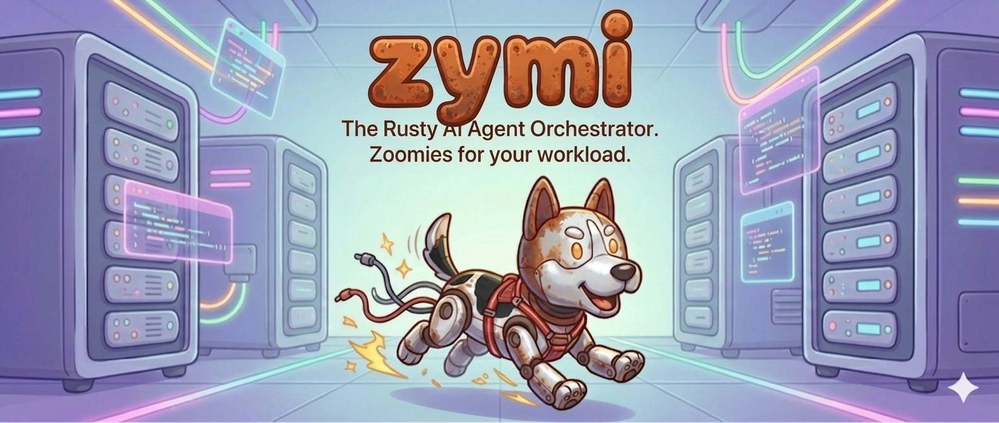

<div align="center">



**Autonomous AI agent with tool use, workflow engine, and long-term memory.**
**Interactive TUI + Telegram bot. Written in Rust.**

[](#installation)
[](#license)

</div>

## What is Zymi

Zymi is a chat-driven AI agent that can plan, execute, and iterate on complex tasks autonomously.

- **Structured decision-making** — agent generates multiple approaches, runs sub-agent feasibility simulations in parallel, and selects the best path forward
- **Workflow engine** — complexity assessment routes simple questions straight to the LLM; multi-step tasks get a DAG with parallel execution, retries, and plan approval
- **Agent eval loop** — create sub-agents, auto-generate evaluation suites, run them with multi-dimensional LLM judge scoring, iterate on the prompt until evals pass
- **20+ built-in tools + any via MCP** — shell, memory, web search, sub-agents, scheduler, code execution. Connect more tools through [Model Context Protocol](https://modelcontextprotocol.io/)
- **Policy engine + audit log** — every shell command passes through allow/deny/approval rules. Every action is logged
- **Two interfaces** — interactive TUI for local use, Telegram bot for remote access
- **Multi-provider** — OpenAI, Anthropic, ChatGPT OAuth (use your Plus/Pro subscription)

## Architecture

```
You ──→ Telegram / TUI
              │
              ▼
        ┌───────────┐
        │ Agent Loop │ ← system prompt (AGENT.md) + conversation history
        │            │ ← model: OpenAI / Anthropic / ChatGPT OAuth
        └─────┬─────┘
              │
     ┌────────┼────────┐
     ▼        ▼        ▼
  Simple    Workflow   Background
  response  Engine     Task
              │
              ▼
        ┌───────────┐
        │ DAG Planner│ → petgraph, parallel execution
        └─────┬─────┘
              │
     ┌────┬───┴───┬────┐
     ▼    ▼       ▼    ▼
   Shell  MCP   Search Sub-agent
     │    tools
     ▼
  Policy Engine ──→ Audit Log
  (allow/deny/approve)
```

## Requirements

- **Rust** 1.75+ (for build from source)
- **OS**: Linux, macOS, Windows
- At least one LLM provider API key (OpenAI, Anthropic, or ChatGPT Plus/Pro)

## Installation

```bash
git clone https://github.com/metravod/zymi && cd zymi
cargo install --path .
```

Pre-built binaries are available on the [Releases](https://github.com/metravod/zymi/releases) page.

For daemon deployment (systemd + Telegram), see [docs/deployment.md](docs/deployment.md).

## Quick start

```bash
# 1. Setup (interactive wizard — picks provider, configures keys)
zymi setup

# 2. Interactive TUI
zymi cli

# 3. Start daemon (Telegram bot + scheduler)
zymi                # background
```

The daemon requires `TELOXIDE_TOKEN` and `ALLOWED_USERS` for Telegram. For local use, `zymi cli` is all you need.

### ChatGPT Plus/Pro login

Use your existing ChatGPT subscription as an LLM provider — no separate API key needed.

```bash
# Local machine (opens browser automatically)
zymi login

# Headless server (VPS, cloud instance — no browser available)
zymi login --remote
# → Prints an auth URL — open it on any device, log in, copy the redirect URL back
```

After login, the ChatGPT OAuth provider appears in `models.json` and can be selected via `/model` in Telegram or `Ctrl+M` in CLI.

## Commands

| Command | Description |
|---------|-------------|
| `zymi` | Start daemon (background) |
| `zymi cli` | Interactive TUI |
| `zymi stop` / `status` / `logs` | Manage daemon |
| `zymi setup` | Run setup wizard |
| `zymi eval [agent]` | Run evaluation suite (`--id`, `--runs`) |
| `zymi update` | Update to latest release |
| `zymi login` | ChatGPT Plus/Pro OAuth (opens browser) |
| `zymi login --remote` | Headless OAuth (paste redirect URL manually) |
| `zymi logout` | Clear stored OAuth tokens |

## Tools

### Built-in

| Tool | Description |
|------|-------------|
| `think` | Structured reasoning (chain-of-thought) |
| `current_time` | Current date and time |
| `ask_user` | Ask user and wait for response |
| `execute_shell` | Shell commands (policy-aware, requires approval) |
| `run_code` | Write and execute Python/Bash/Node.js |
| `read_memory` / `write_memory` | Persistent memory (markdown files in `memory/`) |
| `create_sub_agent` | Create reusable sub-agent with custom system prompt |
| `spawn_sub_agent` | Delegate task to a sub-agent |
| `spawn_task` / `check_task` / `list_tasks` | Background async tasks |
| `manage_schedule` | Cron-like scheduled tasks |
| `manage_mcp` | Connect MCP servers at runtime |
| `manage_policy` | Configure shell command policy |
| `web_search` | Web search via [Tavily](https://tavily.com/) |
| `web_scrape` | Web scraping via [Firecrawl](https://firecrawl.dev/) |
| `youtube_transcript` | YouTube transcripts via Supadata |
| `generate_evals` / `run_evals` | Agent evaluation framework |

### MCP

Any [Model Context Protocol](https://modelcontextprotocol.io/) server — tools are auto-discovered from `mcp.json`. Use `manage_mcp` to connect servers at runtime.

## Telegram commands

| Command | Description |
|---------|-------------|
| `/model [id]` | List or switch models |
| `/clear` | Clear conversation |
| `/status` | Version, model, uptime |

## CLI keyboard shortcuts

| Key | Action |
|-----|--------|
| `Enter` | Send message |
| `Shift+Enter` | New line |
| `Esc` | Quit |
| `Ctrl+M` | Model selector |
| `Ctrl+Y` | Toggle copy mode |
| `Ctrl+Up/Down` | Scroll |
| `PageUp/PageDown` | Scroll 10 lines |

## Configuration

See [docs/configuration.md](docs/configuration.md) for models, MCP, policy, and environment variables.

## Security

See [docs/security.md](docs/security.md) for the policy engine, hardcoded blocks, and audit log.

## Contributing

See [CONTRIBUTING.md](CONTRIBUTING.md).

## License

MIT
