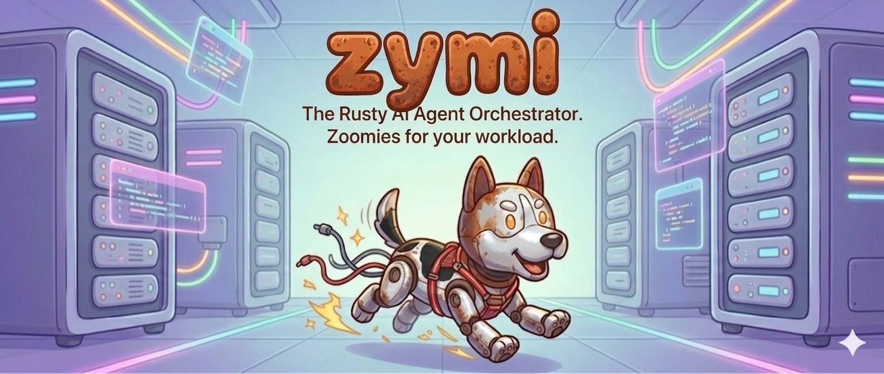

<div align="center">



**Autonomous AI agent with event-driven architecture, workflow engine, and long-term memory.**
**Interactive TUI + Telegram bot. Written in Rust.**

[](#installation)
[](#license)

</div>

## What is Zymi

Zymi is a chat-driven AI agent that plans, executes, and iterates on complex tasks autonomously. It features an event-driven core with intention-based governance, a DAG workflow engine, and a community skill system.

### Key features

- **Event-Driven Architecture** — all messages flow through an event bus with append-only event store. Connectors, agent worker, and projections are fully decoupled
- **ESAA Governance** — tools emit intentions (shell, file write, web search, etc.) that pass through boundary contracts before execution. Hash-chained for auditability
- **Workflow Engine** — complexity assessment routes simple questions to the LLM directly; multi-step tasks get a DAG with parallel execution, retries, and plan approval
- **Skill System** — install community extensions from git repos. Skills use the Claude Code SKILL.md format and are auto-activated by relevance matching
- **20+ Built-in Tools + MCP** — shell, memory, web search, sub-agents, scheduler, code execution. Connect unlimited tools via [Model Context Protocol](https://modelcontextprotocol.io/)
- **Policy Engine + Sandbox** — shell commands pass through allow/deny/approval rules. Optional bubblewrap sandbox for code isolation. Every action is audit-logged
- **Three-column TUI** — chat center, system files sidebar (F1), real-time event observability (F2)
- **Multi-provider** — OpenAI, Anthropic, ChatGPT OAuth (use your Plus/Pro subscription)

## Architecture

```
You ──→ Telegram / CLI TUI
              │
              ▼
     EventDrivenConnector
              │
              ▼
     ┌─────────────────┐
     │    Event Bus     │ ←──→ SQLite Event Store (append-only)
     └────────┬────────┘
              │
              ▼
     ┌─────────────────┐
     │  Agent Worker    │ ← AGENT.md + history + facts + skills
     │                  │ ← model: OpenAI / Anthropic / ChatGPT
     └────────┬────────┘
              │
     ┌────────┼──────────┐
     ▼        ▼          ▼
   Simple   Workflow   Background
   response Engine     Task
              │
              ▼
     ┌─────────────────┐
     │   DAG Planner   │ → petgraph, parallel execution
     └────────┬────────┘
              │
     ┌───┬────┴────┬───┐
     ▼   ▼         ▼   ▼
   Shell MCP    Search Sub-agent
     │   tools
     ▼
  ┌─────────────────────┐
  │ ESAA Orchestrator    │
  │ Intention → Contract │
  │ → Approval → Execute │
  └──────────┬──────────┘
             ▼
       Policy Engine ──→ Audit Log
```

## Requirements

- **Rust** 1.75+
- **OS**: Linux, macOS, Windows
- At least one LLM provider API key (OpenAI, Anthropic, or ChatGPT Plus/Pro)

## Installation

```bash
git clone https://github.com/metravod/zymi && cd zymi
cargo install --path .
```

Pre-built binaries are available on the [Releases](https://github.com/metravod/zymi/releases) page.

For daemon deployment (systemd + Telegram), see [docs/deployment.md](docs/deployment.md).

## Quick start

```bash
# 1. Setup (interactive wizard — picks provider, configures keys)
zymi setup

# 2. Interactive TUI
zymi cli

# 3. Start daemon (Telegram bot + scheduler)
zymi                # background
```

The daemon requires `TELOXIDE_TOKEN` and `ALLOWED_USERS` for Telegram. For local use, `zymi cli` is all you need.

### ChatGPT Plus/Pro login

Use your existing ChatGPT subscription as an LLM provider — no separate API key needed.

```bash
# Local machine (opens browser automatically)
zymi login

# Headless server (VPS, cloud instance — no browser available)
zymi login --remote
# → Prints an auth URL — open it on any device, log in, copy the redirect URL back
```

## Commands

| Command | Description |
|---------|-------------|
| `zymi` | Start daemon (background) |
| `zymi cli` | Interactive TUI |
| `zymi stop` / `status` / `logs` | Manage daemon |
| `zymi setup` | Run setup wizard |
| `zymi eval [agent]` | Run evaluation suite (`--id`, `--runs`) |
| `zymi update` | Update to latest release |
| `zymi login` | ChatGPT Plus/Pro OAuth |
| `zymi logout` | Clear stored OAuth tokens |

## Tools

### Built-in

| Tool | Description |
|------|-------------|
| `ask_user` | Ask user and wait for response |
| `execute_shell` | Shell commands (policy-aware, sandboxed) |
| `run_code` | Execute Python/Bash/Node.js |
| `read_memory` / `write_memory` | Persistent memory (markdown in `memory/`) |
| `planning` | Structured reasoning with sub-agent simulations |
| `create_sub_agent` / `spawn_sub_agent` | Create and delegate to sub-agents |
| `spawn_task` / `check_task` / `list_tasks` | Background async tasks |
| `manage_schedule` | Cron-like scheduled tasks |
| `manage_mcp` | Connect MCP servers at runtime |
| `manage_skills` | Install/update/remove community skills |
| `manage_policy` | Configure shell command policy |
| `web_search` | Web search via [Tavily](https://tavily.com/) |
| `web_scrape` | Web scraping via [Firecrawl](https://firecrawl.dev/) |
| `youtube_transcript` | YouTube transcripts via Supadata |
| `generate_evals` / `run_evals` | Agent evaluation framework |
| `current_time` | Current date and time |

### MCP

Any [Model Context Protocol](https://modelcontextprotocol.io/) server. Tools are auto-discovered from `mcp.json`. Use `manage_mcp` to connect servers at runtime.

### Skills

Community-contributed extensions installed from git repos. Skills add knowledge (injected into agent context when relevant) and/or MCP tool servers.

```bash
# The agent can install skills at runtime:
# manage_skills {"action": "install", "repo": "https://github.com/user/skills-repo"}
```

Skills use the [Claude Code SKILL.md format](docs/skills.md) with YAML frontmatter for auto-activation.

## CLI TUI

Three-column layout with real-time observability:

| Key | Action |
|-----|--------|
| `Enter` | Send message |
| `Shift+Enter` | New line |
| `F1` | Toggle sidebar (models, files, sub-agents) |
| `F2` | Toggle events panel (real-time observability) |
| `Esc` | Interrupt agent / close sidebar |
| `Q` | Quit (in sidebar) |
| `Tab` | Navigate sidebar items |
| `Ctrl+M` | Model selector |
| `Ctrl+Y` | Toggle copy mode |
| `Ctrl+Up/Down` | Scroll |
| `PageUp/PageDown` | Scroll 10 lines |

## Telegram commands

| Command | Description |
|---------|-------------|
| `/model [id]` | List or switch models |
| `/clear` | Clear conversation |
| `/status` | Version, model, uptime |

Supports photo/image messages (multimodal) with all vision-capable models.

## Documentation

| Document | Description |
|----------|-------------|
| [Architecture](docs/architecture.md) | System architecture and data flow |
| [Tools](docs/tools.md) | All tools with detailed descriptions |
| [Skills](docs/skills.md) | Skill system guide and SKILL.md format |
| [Workflow Engine](docs/workflow-engine.md) | DAG planning and execution |
| [EDA & ESAA](docs/eda-esaa.md) | Event-driven architecture and governance |
| [TUI](docs/tui.md) | CLI TUI guide and keybindings |
| [Configuration](docs/configuration.md) | Models, MCP, policy, env vars |
| [Security](docs/security.md) | Policy engine, contracts, sandbox, audit |
| [Deployment](docs/deployment.md) | Systemd daemon setup |

## Contributing

See [CONTRIBUTING.md](CONTRIBUTING.md).

## License

MIT
